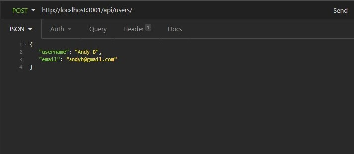
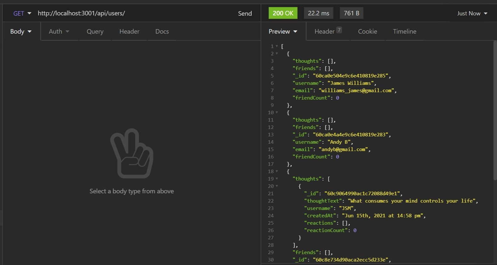
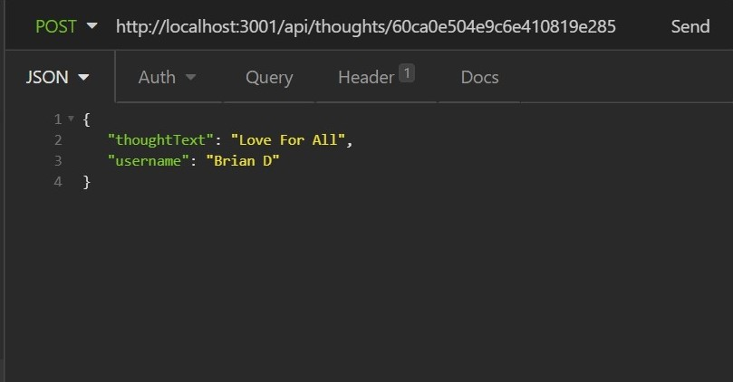
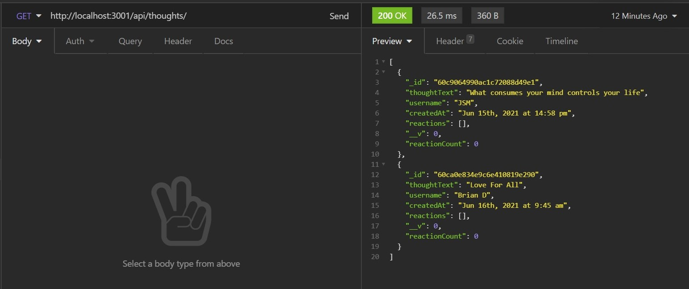
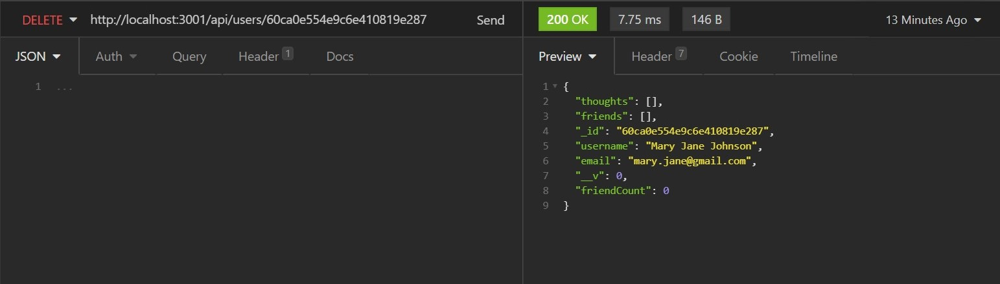
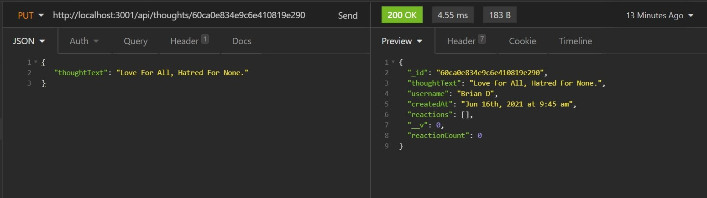

# Social Network API

## Description

The social network api has been built for a social network web application where users can share their thoughts, react to friends’ thoughts, and create a friend list. This application uses Express.js for routing, a MongoDB database, and the Mongoose ODM.

Please [click here](https://murmuring-mountain-65060.herokuapp.com/) to be directed to a walkthrough video of the application.

## Usage

Below screenshots of some of the features for reference.

- Creating an user;

  

- Finding all users;

  

- Creating a thought.

  

- Finding all thoughts

  

- Deleting an user

  

- Updating a thought

  
